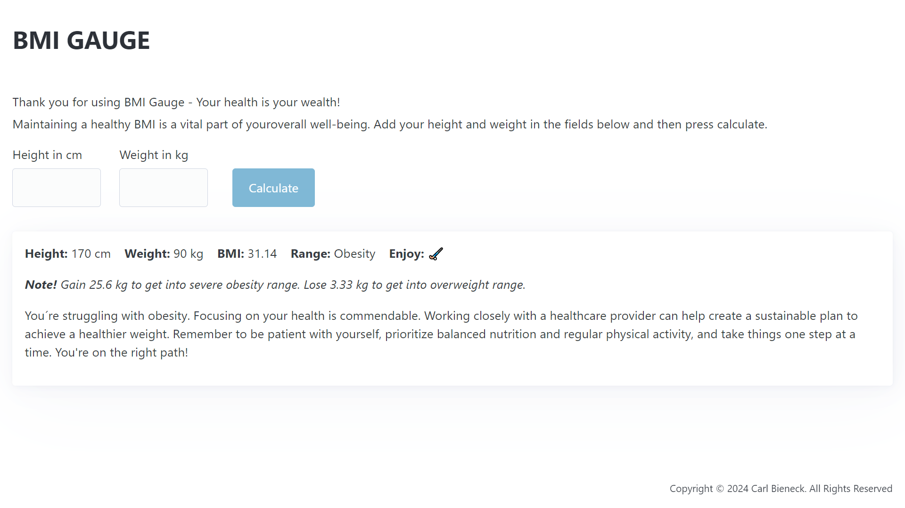

# BMI Gauge

Thank you for using BMI Gauge - Your health is your wealth! Maintaining a healthy BMI is a vital part of your overall well-being.

## Big-picture plan

The background for this assignment was that we had the weekend to build our first basic full-stack application from scratch. The requirement was to use a Node HTTP server for the backend. For the frontend, a single HTML page with a form should be used, allowing the user to input their data and send it to the server. Vanilla JavaScript (TypeScript) should be employed to manipulate the DOM, listen to events, and make network requests using the Fetch API. Client runs with the _http-server_.

My big-picture plan was to create a cool and user-friendly full-stack application. Users should be able to enter their height and weight on the page. Upon submission, the data is sent to the server via an HTTP POST request. The server then validates the data and performs various calculations. An HTTP response with the calculated BMI (Body Mass Index) is sent back to the client, where it’s rendered on the page.

```plaintext

[ User ]
   |
   v
[ HTML Client ]
   | Enter height and weight
   v
[ HTTP POST ]
   |
   v
[ Node.js Server ]
   | Validate request and calculate BMI related information
   v
[ HTTP Response ]
   |
   v
[ HTML Client ]
   | Display BMI response information
   v
[ User ]
```

[Planning board](https://github.com/orgs/saltsthlm/projects/117/views/1)

## BMI Gauge in detail

The client index.html page consist of one _Calculate_ submission button and two input fields for entering data; _Height in cm_ and _Weight in kg_. 

Upon start _Calculate_ button is disabled. Validation is done client side to check that input meets criteria of what is allowed. No need to do a costly roundtrip to server for this validation. Input must be string representations of numbers. Height must be between 80 and 280 cm. Weight must be between 20 and 700 kg. Ones these criteria are fulfilled _Calculate_ button will be enabled and input can be sent to server.

The server parses the request body and sends it to a main function _getBmiResponse_. Initial validation ensures that we don't rely solely on client-side validation. The data is then passed to various sub-functions for further calculations. A response data object of the following type is created:

```plaintext
type BmiResponse = {
  height: number;
  weight: number;
  bmi: number;
  range: string;
  emoji: string;
  info: string;
  advice: string;  
};
```
_height_ and _weight_ are the values entered by the user. _bmi_ is calculated based on these numbers. _range_ is a string representation indicating where you fall on the BMI scale: _Underweight_, _Healthy_, _Overweight_, _Obesity_ and _Severe obesity_. The _emoji_ visually suggests what you should ideally do based on your BMI scale position. For instance, if you're underweight, a random emoji of food or drink will be displayed. If you're overweight, a random emoji representing a sport activity will appear. _info_ provides the number of kilograms needed to reach the next range(s). Finally, _advice_ offers a pat on the back and suggests what to do next.

If a user, for example, enters a height of 170 cm and a weight of 90 kg, this is how it will look:



## New technincal concept

Using emojis for this project was the first thing that came to mind. Since I'd never used an emoji library before and thought it would suit the application perfectly, I decided to give it a try. I used a library called _node-emoji_. It turned out to be really easy to use and did exactly what I wanted it to do. I highly recommend it.
